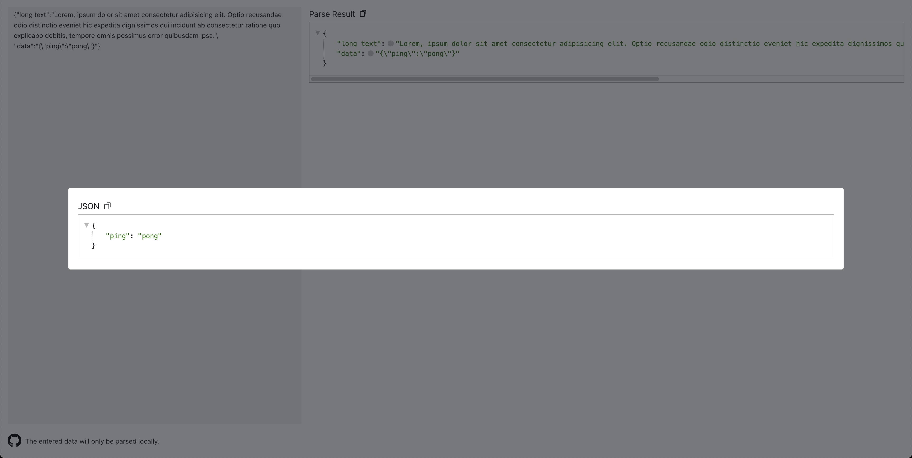

# Data Viewer

## 介绍

在本地展示数据的可视化工具，效果如下：



## 使用方法

### 在线使用

访问网页：https://conanyu.github.io/data-viewer

### 本地部署

在开始之前，需要保证已经安装了以下工具：

- [Node.js](https://nodejs.org/)
- [pnpm](https://pnpm.io/)

克隆项目并进入项目目录安装依赖部署：

```bash
git clone https://github.com/conanyu/data-viewer.git
cd data-viewer/app/page
pnpm install
pnpm dev
```

成功部署后，在浏览器中访问 `http://localhost:5173/data-viewer` 即可查看应用。

### SDK

1. 使用SDK前需要保证shadcn框架已安装，具体安装方法请参考：https://ui.shadcn.com/docs/installation

2. 添加本项目依赖

```bash
pnpm dlx shadcn@latest add https://raw.githubusercontent.com/ConanYu/data-viewer/refs/heads/main/app/page/public/r/data-viewer.json
```

3. 引入组件

```jsx
import { DataViewer } from "@/components/ui/conanyu/data-viewer";

const data = {
  users: [
    { id: 1, name: "Alice", age: 30 },
    { id: 2, name: "Bob", age: 25 },
    { id: 3, name: "Charlie", age: 35 },
  ],
  metadata: {
    createdAt: "2023-01-15",
    source: "API",
  },
};

const App = () => {
  return <DataViewer title="Data Viewer Demo" data={JSON.stringify(data)} />;
};
```

## 开源协议

本项目基于 MIT 协议开源，您可以在遵守协议的前提下自由使用、修改和分发本项目的代码。
